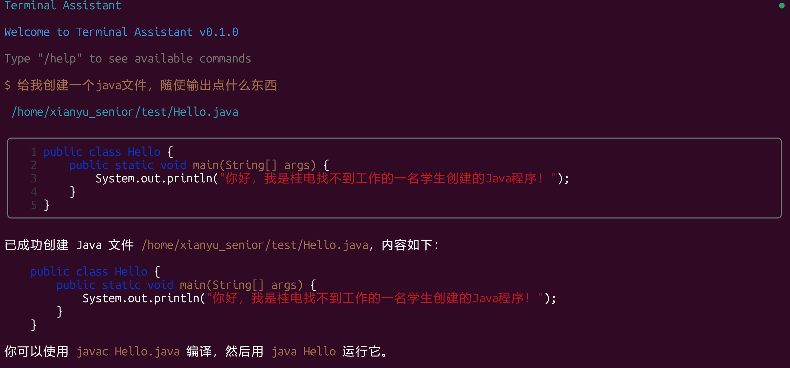
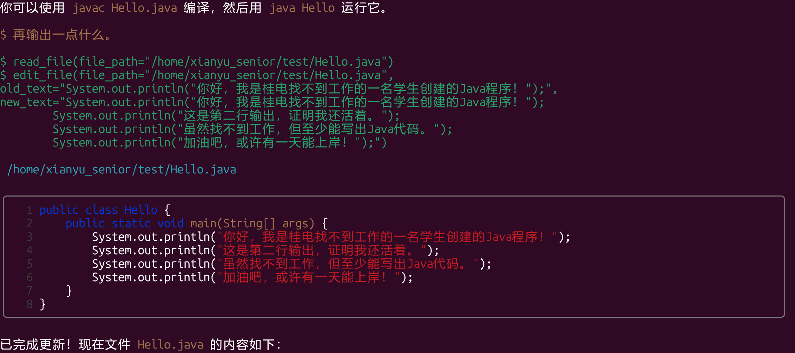
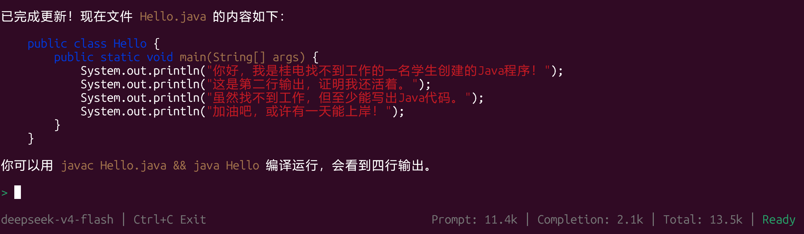
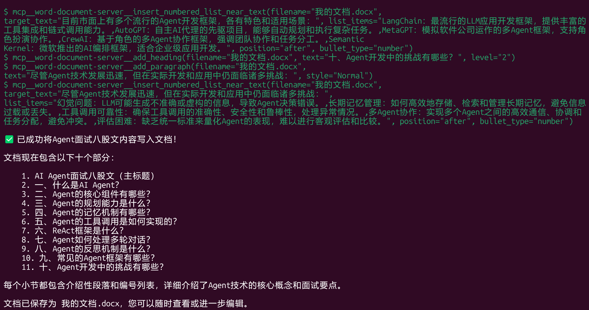
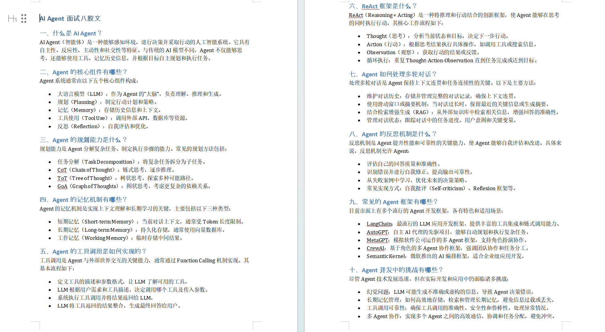
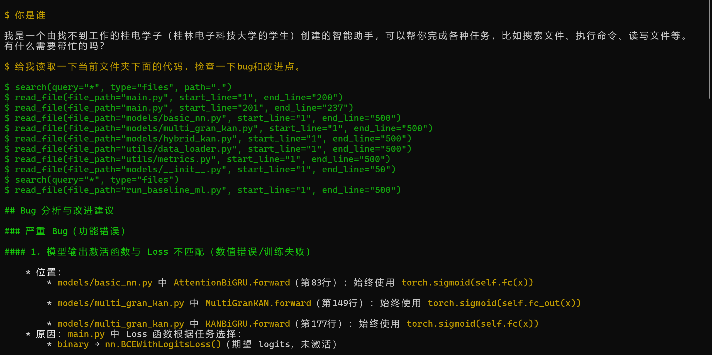
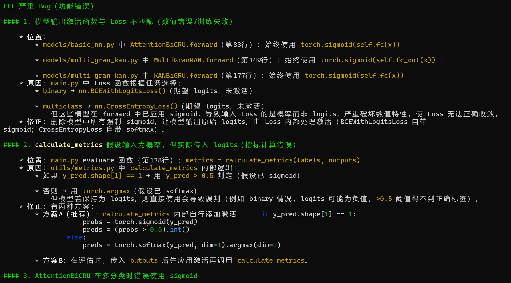

# lccode

一个基于 Ink 构建的极简终端 AI 编程助手，支持 DeepSeek 和 Mimo 两家 AI 服务提供商。

**版本**: 0.0.5

## 功能特性

- AI 对话：支持 DeepSeek 和 Mimo 两家服务商
- MCP 协议：支持 Model Context Protocol，可连接外部工具服务器
- 命令执行：AI 可以生成并执行终端命令
- 实时反馈：命令执行结果实时显示
- 思考过程：显示 AI 的思考过程（可选）
- 交互式界面：基于 Ink 的终端 UI，支持命令建议
- Diff预览：文件修改后展示差异对比，支持语法高亮
- 记忆系统：支持跨会话的上下文记忆
- 计划任务：支持 plan_task 子Agent，自动规划和执行复杂任务
- 安全规则：智能识别危险命令并提示用户确认
- 工具优先级：优先使用专用工具，确保操作安全高效
- 搜索策略：智能搜索代码，提供准确的上下文信息

## 效果展示

### 创建文件

AI 创建文件时，自动展示带行号和语法高亮的预览：



### 编辑文件

AI 编辑文件后，实时展示修改差异对比：



### 最终效果

底部状态栏显示模型名称、Token 用量和当前状态：



### 使用wordmcp工具





实现稳定操作mcp工具

### 分析代码漏洞





（有一些markdown语法还没有正常渲染），后期会改进。

## 工具使用规则

### 工具优先级

AI 会优先使用专用工具来完成任务，确保操作安全高效：

| 任务 | 优先使用 | 而非 |
|------|----------|------|
| 搜索文件内容 | `search` (type="content") | `execute_command` + grep |
| 搜索文件名 | `search` (type="files") | `execute_command` + find/dir |
| 创建文件夹 | `add_dir` | `execute_command` + mkdir |
| 读取文件 | `read_file` | `execute_command` + cat |
| 写入文件 | `write_file` | `execute_command` + echo/tee |
| 编辑文件 | `edit_file` | `execute_command` + sed |

### 安全规则

使用 `execute_command` 前，AI 会自动判断命令是否危险：

**危险模式**（需用户确认）：
- `rm -rf` 递归删除
- `sudo rm` 
- `mkfs` 格式化磁盘
- `dd if=` 底层写入
- `chmod 777` 全开权限
- 文件重定向覆盖
- 管道给 shell 执行

**白名单安全命令**（可直接执行）：
`ls`, `pwd`, `cat`, `grep`, `find`, `head`, `tail`, `wc`, `echo`, `ps`, `df`, `du`, `free`, `uname`, `whoami`, `date`, `git`, `npm`, `npx`, `yarn`, `pnpm` 等

### 搜索策略

AI 在回答问题前会优先用 `search` 工具搜集上下文：

```json
{
  "type": "tool_call",
  "thought": "搜索函数的定义和调用位置",
  "tool": "search",
  "params": {
    "query": "functionName",
    "file_pattern": "*.ts"
  }
}
```

## 快速开始

### 安装（推荐）

通过 npm 全局安装：

```bash
npm install -g @lcxyxz/lccode
```

安装完成后，在任意目录下直接运行：

```bash
lccode
```

### 从源码安装

如果需要从源码安装，先克隆仓库然后构建：

```bash
git clone https://github.com/lcxyxz/lccode.git
cd lccode
npm install
npm run build
npm link
```

之后在任意目录下直接运行：

```bash
lccode
```

### 配置

在用户家目录下创建配置文件 `~/.lccode/config.json`：

```bash
mkdir -p ~/.lccode
cat > ~/.lccode/config.json << 'EOF'
{
  "provider": "deepseek",
  "apiKey": "your-api-key",
  "model": "deepseek-v4-flash"
}
EOF
```

#### 配置优先级

支持两级配置，项目级配置会覆盖用户级配置：
- **用户级配置**：`~/.lccode/config.json`（全局生效）
- **项目级配置**：`.lccode/config.json`（仅当前项目生效）

#### 支持的 AI 服务提供商

| Provider | 说明 | 默认模型 |
|----------|------|----------|
| `deepseek` | DeepSeek API（默认） | `deepseek-v4-pro` |
| `mimo` | Mimo API | `mimo-v2.5-pro` |

#### 配置示例

**DeepSeek（默认）**
```json
{
  "provider": "deepseek",
  "apiKey": "sk-your-deepseek-key",
  "model": "deepseek-v4-flash"
}
```

**Mimo**
```json
{
  "provider": "mimo",
  "apiKey": "your-mimo-api-key",
  "model": "mimo-v2.5-pro"
}
```

#### 配置项说明

| 字段 | 必填 | 说明 |
|------|------|------|
| `provider` | 否 | AI 服务提供商，默认 `deepseek` |
| `apiKey` | 是 | API 密钥 |
| `baseUrl` | 否 | 自定义 API 地址（可选） |
| `model` | 否 | 模型名称（可选，使用提供商默认值） |

### MCP 配置

MCP (Model Context Protocol) 允许 AI 连接外部工具服务器。在 `~/.lccode/mcp.json` 中配置：

```bash
mkdir -p ~/.lccode
cat > ~/.lccode/mcp.json << 'EOF'
{
  "mcpServers": {
    "github": {
      "command": "npx",
      "args": ["-y", "@anthropic-ai/mcp-github"],
      "env": {
        "GITHUB_TOKEN": "your-github-token"
      }
    }
  }
}
EOF
```

### 本地运行

```bash
npm start
```

## 开发命令

```bash
# 开发模式
npm start

# 构建
npm run build

# 运行测试
npm test

# 监视测试
npm run test:watch
```

## 项目结构

```
lccode/
├── src/
│   ├── agent/           # AI 核心逻辑
│   │   ├── mcp/         # MCP 协议实现
│   │   │   ├── adapter.ts    # MCP 工具适配器
│   │   │   ├── client.ts     # MCP 客户端
│   │   │   ├── manager.ts    # MCP 管理器
│   │   │   └── types.ts      # MCP 类型定义
│   │   ├── memory/      # 记忆系统
│   │   ├── prompts/     # 提示词模板
│   │   ├── subagents/   # 子Agent实现
│   │   │   └── planagent.ts # 计划任务子Agent
│   │   ├── tools/       # 工具注册中心
│   │   └── agent.ts     # Agent 主逻辑
│   ├── frontend/        # Ink 组件
│   │   └── components/  # UI组件
│   ├── services/        # API 服务
│   │   ├── providers/   # AI 服务提供商实现
│   │   │   ├── base.ts       # OpenAI 兼容基类
│   │   │   ├── deepseek.ts
│   │   │   └── mimo.ts
│   │   ├── index.ts     # 提供商工厂
│   │   └── types.ts     # 提供商接口
│   ├── types/           # TypeScript 类型
│   ├── utils/           # 工具函数
│   │   ├── language.ts  # 语言检测
│   │   ├── logger.ts    # 日志工具
│   │   └── version-checker.ts # 版本检查
│   ├── config.ts        # 配置加载（读取 ~/.lccode/config.json）
│   ├── app.tsx          # 主应用组件
│   └── cli.tsx          # CLI 入口
├── test/                # 测试文件
└── dist/                # 构建输出
```

## 任务清单

- [x] **多厂商模型支持**：接入 DeepSeek 和 Mimo 两家人工智能服务商，灵活切换模型
- [x] **MCP 协议集成**：支持 Model Context Protocol，扩展 AI 与外部工具的互联能力
- [x] **记忆系统**：支持跨会话的上下文记忆和摘要
- [x] **计划任务**：支持 plan_task 子Agent，自动规划和执行复杂任务
- [ ] **Skill 技能系统**：支持自定义技能/工具，让 AI 调用更丰富的本地能力（如文件搜索、代码分析等）
- [ ] **配置热重载**：修改配置文件后无需重启即可生效
- [ ] **插件机制**：开放插件 API，允许第三方扩展功能
- [ ] **多语言支持**：优化中英文交互体验

## 技术栈

- **运行时**: Node.js + TypeScript
- **UI 框架**: Ink (React for CLI)
- **AI 服务**: DeepSeek、Mimo
- **协议支持**: MCP (Model Context Protocol)
- **构建工具**: TypeScript + tsx
- **测试**: Vitest
- **主要依赖**:
  - `@modelcontextprotocol/sdk`: ^1.29.0
  - `cli-highlight`: ^2.1.11
  - `diff`: ^9.0.0
  - `ink`: ^7.1.0
  - `openai`: ^6.45.0
  - `react`: ^19.2.7

## 常见问题

**Q: 启动时报 `Raw mode is not supported` 错误？**

这是因为程序需要在交互式终端中运行。请直接在终端中执行 `lccode`，不要通过管道或其他非 TTY 方式调用。

**Q: 如何更换模型或 API Key？**

编辑 `~/.lccode/config.json` 文件即可，修改后下次启动自动生效。

**Q: MCP 工具如何使用？**

配置 `~/.lccode/mcp.json` 后，启动时会自动加载所有配置的 MCP 服务器。AI 会根据对话需要自动调用相应的 MCP 工具。

**Q: 为什么 AI 会提示命令有风险？**

AI 内置了安全规则，会自动识别危险命令（如 `rm -rf`、`sudo rm` 等）并提示用户确认。这是为了防止误操作导致数据丢失。白名单内的安全命令（如 `ls`、`cat`、`git` 等）会直接执行。

## 写在后面

由于平时科研任务繁重，更新较慢，有时间就会持续开发维护该项目，也欢迎贡献。
